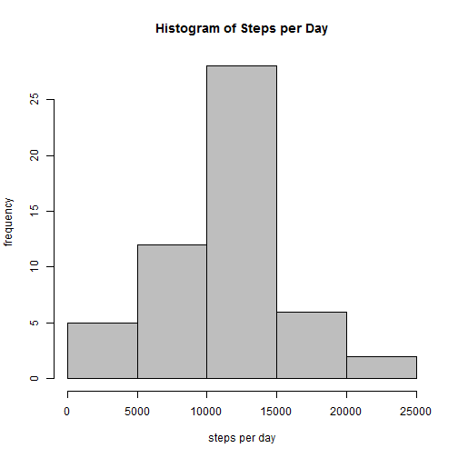

Assignment 1 for Reproducible Research
========================================================

## Loading and preprocessing the data

Load data file activity.csv. 


```r
data <- read.csv("activity.csv", header=TRUE, colClasses=c("integer", "Date", "integer"))
summary(data)
```

```
##      steps             date               interval     
##  Min.   :  0.00   Min.   :2012-10-01   Min.   :   0.0  
##  1st Qu.:  0.00   1st Qu.:2012-10-16   1st Qu.: 588.8  
##  Median :  0.00   Median :2012-10-31   Median :1177.5  
##  Mean   : 37.38   Mean   :2012-10-31   Mean   :1177.5  
##  3rd Qu.: 12.00   3rd Qu.:2012-11-15   3rd Qu.:1766.2  
##  Max.   :806.00   Max.   :2012-11-30   Max.   :2355.0  
##  NA's   :2304
```

There are missing values only in steps column. 

## What is mean total number of steps taken per day?

Get a new dataset which ignored the missing values. 


```r
data1 <- data[!is.na(data$steps),]

summary(data1)
```

```
##      steps             date               interval     
##  Min.   :  0.00   Min.   :2012-10-02   Min.   :   0.0  
##  1st Qu.:  0.00   1st Qu.:2012-10-16   1st Qu.: 588.8  
##  Median :  0.00   Median :2012-10-29   Median :1177.5  
##  Mean   : 37.38   Mean   :2012-10-30   Mean   :1177.5  
##  3rd Qu.: 12.00   3rd Qu.:2012-11-16   3rd Qu.:1766.2  
##  Max.   :806.00   Max.   :2012-11-29   Max.   :2355.0
```

### Make a histogram of the total number of steps taken each day

Aggregate the data with regards to date. 


```r
stepsDay <- aggregate(data1$steps, by=list(date=data1$date), FUN=sum)
colnames(stepsDay)[2] <- 'steps'

hist(stepsDay$steps, main="Histogram of Steps per Day", col="grey", xlab="steps per day", ylab="frequency")
```

 

### Calculate and report the mean and median total number of steps taken per day

The mean of the total number of steps taken per day

```r
mean(stepsDay$steps)
```

```
## [1] 10766.19
```

The median of the total number of steps taken per day

```r
median(stepsDay$steps)
```

```
## [1] 10765
```

## What is the average daily activity pattern?

### Make a time series plot (i.e. type = "l") of the 5-minute interval (x-axis) and the average number of steps taken, averaged across all days (y-axis)

Aggregate the data with regards to interval. 


```r
stepsInterval <- aggregate(data1$steps, by=list(interval=data1$interval), FUN=mean)
colnames(stepsInterval)[2] <- 'average steps'

plot(stepsInterval, type="l", main="average steps across all day")
```

 

### Which 5-minute interval, on average across all the days in the dataset, contains the maximum number of steps?


```r
stepsInterval[which.max(stepsInterval[,2]),1]
```

```
## [1] 835
```


## Imputing missing values

Now we impute the missing values in the original data instead of ignor them.

### Calculate and report the total number of missing values in the dataset (i.e. the total number of rows with NAs)


```r
sum(is.na(data))
```

```
## [1] 2304
```

### Create a new dataset that is equal to the original dataset but with the missing data filled in.

There are missing values only in steps column. 


```r
summary(data)
```

```
##      steps             date               interval     
##  Min.   :  0.00   Min.   :2012-10-01   Min.   :   0.0  
##  1st Qu.:  0.00   1st Qu.:2012-10-16   1st Qu.: 588.8  
##  Median :  0.00   Median :2012-10-31   Median :1177.5  
##  Mean   : 37.38   Mean   :2012-10-31   Mean   :1177.5  
##  3rd Qu.: 12.00   3rd Qu.:2012-11-15   3rd Qu.:1766.2  
##  Max.   :806.00   Max.   :2012-11-30   Max.   :2355.0  
##  NA's   :2304
```

Use the mean for that 5-minute intervalto impute missing value, which is already calculated in the above question as data frame stepsInterval. 


```r
dataImputed <- data
NAindex <- which(is.na(dataImputed))
for (i in NAindex){
        dataImputed[i,1]<- stepsInterval[stepsInterval$interval==dataImputed$interval[i],2]
}
summary(dataImputed)
```

```
##      steps             date               interval     
##  Min.   :  0.00   Min.   :2012-10-01   Min.   :   0.0  
##  1st Qu.:  0.00   1st Qu.:2012-10-16   1st Qu.: 588.8  
##  Median :  0.00   Median :2012-10-31   Median :1177.5  
##  Mean   : 37.38   Mean   :2012-10-31   Mean   :1177.5  
##  3rd Qu.: 27.00   3rd Qu.:2012-11-15   3rd Qu.:1766.2  
##  Max.   :806.00   Max.   :2012-11-30   Max.   :2355.0
```


### Make a histogram of the total number of steps taken each day

Aggregate the Imputed data with regards to date. 


```r
stepsDayImputed <- aggregate(dataImputed$steps, by=list(date=dataImputed$date), FUN=sum)
colnames(stepsDayImputed)[2] <- 'steps'

hist(stepsDayImputed$steps, main="Histogram of Steps per Day of Imputed Data", col="grey", xlab="steps per day", ylab="frequency")
```

 

### Calculate and report the mean and median total number of steps taken per day 

The mean of the total number of steps taken per day of the Imputed data

```r
mean(stepsDayImputed$steps)
```

```
## [1] 10766.19
```

The median of the total number of steps taken per day of the Imputed data

```r
median(stepsDayImputed$steps)
```

```
## [1] 10766.19
```

### Do these values differ from the estimates from the first part of the assignment? What is the impact of imputing missing data on the estimates of the total daily number of steps?

For this particular case, the mean is the same, but the median is different.  Imputing missing data will change the distribution of the total daily number of steps a little bit but not too much.


## Are there differences in activity patterns between weekdays and weekends?

Add variable CalendarDay as factor to data frame dataImputed to state weekdays and weekends. 


```r
w1 <- weekdays(dataImputed$date)
CalendarDay<- rep("weekdays", length(w1))
for (i in 1:length(w1)){
        if (w1[i]=="Saturday" | w1[i]=="Sunday"){
                CalendarDay[i] <- "weekends"
        }
}
dataImputed$CalendarDay <- as.factor(CalendarDay)
```

Get average daily activity data for the imputed data and plot the average daily activity pattern with regards to weekdays and weekends.


```r
stepsIntervalImputed <- aggregate(dataImputed$steps, by=list(interval=dataImputed$interval, CalendarDay= dataImputed$CalendarDay), FUN=mean)

colnames(stepsIntervalImputed)[3] <- 'AverageSteps'

library(lattice)
xyplot(AverageSteps ~ interval|CalendarDay, data=stepsIntervalImputed, layout=c(1,2), type="l", xlab="Intervals", ylab="average steps", main="Comparison of Average Daily Activity Pattern between Weekdays and Weekends")
```

 

